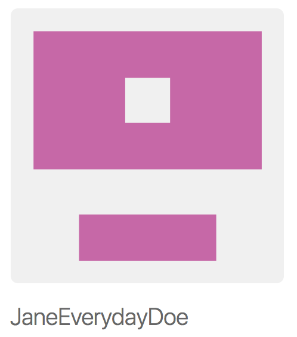

{width=100px}

## About

I'm a fictional character that was made to illustrate different concepts related to Data Science.

## Interests

* R
* Making websites

## Projects

* This [website](https://github.com/JaneEverydayDoe/janeeverydaydoe.github.com) is my first project!

## Profiles 

* [GitHub](http://github.com/JaneEverydayDoe)

## Contact

* [Jane.Everyday.Doe@gmail.com](mailto:Jane.Everyday.Doe@gmail.com)
