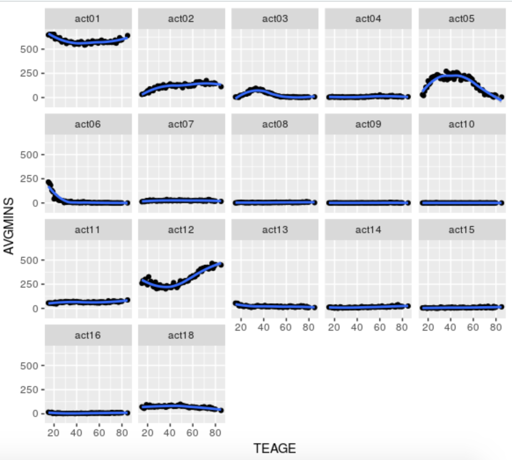

### ATUS Project

```{r, out.width = "200px", echo=FALSE}

```

[ATUS Survey Analysis](projects/ATUS_project.html)

A brief description of what you did / what questions you answered could be included